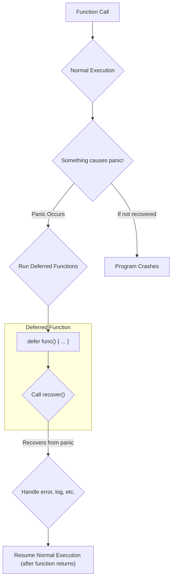

# အခန်း ၁၄: Error Handling

Go တွင် error handling သည် အခြား programming languages များစွာနှင့် ကွဲပြားပါသည်။ `try-catch` block များအစား Go သည် errors များကို function return values များအဖြစ် သာမန်တန်ဖိုးများကဲ့သို့ပင် ကိုင်တွယ်သည်။ ဤအခန်းတွင် Go ၏ error handling ပုံစံ၊ custom errors များ တည်ဆောက်ပုံ၊ နှင့် `panic`/`recover` တို့၏ အသုံးဝင်ပုံများကို လေ့လာသွားပါမည်။


## Go ၏ Error Handling ပုံစံ (`error` type)

Go တွင် error ဖြစ်နိုင်ခြေရှိသော function များသည် `error` type ကို ၎င်းတို့၏ နောက်ဆုံး return value အဖြစ် ပြန်ပေးလေ့ရှိသည်။ `error` သည် အောက်ပါအတိုင်း method တစ်ခုတည်းသာပါဝင်သော built-in interface တစ်ခုဖြစ်သည်။

```go
type error interface {
    Error() string
}
```

Function တစ်ခုကို ခေါ်ယူသည့်အခါ developer သည် ပြန်လာသော `error` value ကို `nil` ဟုတ်မဟုတ် စစ်ဆေးရန် တာဝန်ရှိသည်။ `nil` မဟုတ်ပါက error ဖြစ်ပွားခဲ့သည်ဟု မှတ်ယူပြီး သင့်လျော်သလို ကိုင်တွယ်ရမည်။

```go
package main

import (
    "fmt"
    "strconv"
)

func main() {
    // "123" သည် ကိန်းဂဏန်းဖြစ်သောကြောင့် error သည် nil ဖြစ်မည်
    num, err := strconv.Atoi("123")
    if err != nil {
        fmt.Println("An error occurred:", err)
    } else {
        fmt.Println("Converted number:", num)
    }

    // "abc" သည် ကိန်းဂဏန်းမဟုတ်သောကြောင့် error ဖြစ်ပွားမည်
    num, err = strconv.Atoi("abc")
    if err != nil {
        fmt.Println("An error occurred:", err)
    } else {
        fmt.Println("Converted number:", num)
    }
}
```


## Custom Errors များ တည်ဆောက်ခြင်း

Go တွင် error message များကို ပိုမိုအသေးစိတ်ဖော်ပြရန် custom error များ တည်ဆောက်နိုင်သော နည်းလမ်းများစွာရှိသည်။

### 1. `errors.New()`

`errors` package မှ `New()` function ကို အသုံးပြု၍ ရိုးရှင်းသော error message string တစ်ခုကို ဖန်တီးနိုင်သည်။

```go
import "errors"

func checkAge(age int) error {
    if age < 18 {
        return errors.New("age must be at least 18")
    }
    return nil
}
```

### 2. `fmt.Errorf()`

`fmt.Errorf()` function သည် error message ကို format လုပ်ရန်နှင့် အခြား error များကို "wrap" လုပ်ရန် အသုံးပြုသည်။ `%w` verb ကို အသုံးပြု၍ error တစ်ခုကို wrap လုပ်ခြင်းဖြင့် မူလ error ကို ဆက်လက်ထိန်းသိမ်းထားနိုင်ပြီး၊ `errors.Is()` သို့မဟုတ် `errors.As()` ဖြင့် ပြန်လည်စစ်ဆေးနိုင်သည်။

```go
import (
    "fmt"
    "os"
)

func readFile() error {
    file, err := os.Open("non-existent-file.txt")
    if err != nil {
        return fmt.Errorf("failed to read file: %w", err)
    }
    defer file.Close()
    return nil
}
```

### 3. Custom Error Struct

Error နှင့်ပတ်သက်သော အသေးစိတ်အချက်အလက်များ (e.g., status code, operation name) ကို ထည့်သွင်းလိုပါက custom struct တစ်ခုကို ဖန်တီးပြီး `Error()` method ကို implement လုပ်နိုင်သည်။

```go
package main

import "fmt"

// AppError struct သည် error နှင့်ပတ်သက်သော အချက်အလက်များကို သိမ်းဆည်းသည်
type AppError struct {
    Operation string
    Code      int
    Message   string
}

// AppError အတွက် Error() method ကို implement လုပ်ခြင်း
func (e *AppError) Error() string {
    return fmt.Sprintf("operation '%s' failed with code %d: %s", e.Operation, e.Code, e.Message)
}

func runOperation() error {
    return &AppError{
        Operation: "user_login",
        Code:      401,
        Message:   "invalid credentials",
    }
}

func main() {
    err := runOperation()
    if err != nil {
        fmt.Println(err)
    }
}
```


## Checking Wrapped Errors (`errors.Is` and `errors.As`)

Error များကို `fmt.Errorf` နှင့် `%w` အသုံးပြု၍ wrap လုပ်လိုက်သောအခါ၊ မူလ error type ကို တိုက်ရိုက်စစ်ဆေး၍မရတော့ပါ။ (ဥပမာ - `err == os.ErrNotExist` သည် false ဖြစ်သွားနိုင်သည်)။ ထိုအခါမျိုးတွင် `errors` package မှ helper function များကို အသုံးပြုရပါမည်။

### 1. `errors.Is()`

Error တစ်ခုသည် သီးခြား error value တစ်ခု ဟုတ်မဟုတ် (wrapped လုပ်ထားသည့်တိုင်) စစ်ဆေးရန် အသုံးပြုသည်။

```go
import (
    "errors"
    "fmt"
    "os"
)

func main() {
    // Error ကို wrap လုပ်ခြင်း
    err := fmt.Errorf("file error: %w", os.ErrNotExist)

    // errors.Is ဖြင့် စစ်ဆေးခြင်း
    if errors.Is(err, os.ErrNotExist) {
        fmt.Println("File does not exist")
    }
}
```

### 2. `errors.As()`

Error တစ်ခုသည် သီးခြား error type တစ်ခု ဟုတ်မဟုတ် စစ်ဆေးပြီး၊ ဟုတ်မှန်ပါက ထို type သို့ cast လုပ်ရန် အသုံးပြုသည်။

```go
type MyError struct {
    Code int
}

func (e *MyError) Error() string {
    return fmt.Sprintf("error code: %d", e.Code)
}

func main() {
    err := fmt.Errorf("wrapped: %w", &MyError{Code: 404})

    var myErr *MyError
    // errors.As သည် err chain ကို ရှာဖွေပြီး match ဖြစ်ပါက myErr ထဲသို့ တန်ဖိုးထည့်ပေးသည်
    if errors.As(err, &myErr) {
        fmt.Println("It is MyError with code:", myErr.Code)
    }
}
```


## `panic` နှင့် `recover`

`panic` နှင့် `recover` သည် Go ၏ error handling mechanism ၏ အစိတ်အပိုင်းတစ်ခုဖြစ်သော်လည်း၊ ၎င်းတို့ကို နေ့စဉ် error handling အတွက် **အသုံးမပြုသင့်ပါ**။

*   **`panic`:** Program တွင် ဆက်လက်လုပ်ဆောင်၍မရသော၊ မမျှော်လင့်ထားသည့် အမှားအယွင်းကြီးများ (e.g., nil pointer dereference, index out of bounds) ဖြစ်ပွားသည့်အခါ `panic` ကို အသုံးပြုသည်။ `panic` ဖြစ်ပွားပါက program ၏ normal execution ရပ်တန့်သွားပြီး goroutine stack တစ်လျှောက်ရှိ deferred functions များကို run ပြီးနောက် program သည် crash ဖြစ်သွားသည်။

*   **`recover`:** `panic` ဖြစ်ပွားနေသော goroutine ၏ control ကို ပြန်လည်ရယူရန် `recover` ကို အသုံးပြုသည်။ `recover` ကို `defer` statement အတွင်းမှာသာ ခေါ်ယူမှသာ အလုပ်လုပ်သည်။ ၎င်းသည် `panic` ၏ value ကို return ပြန်ပေးပြီး program ကို ဆက်လက် run စေနိုင်သည်။

**အသုံးဝင်ပုံ:** Web server တစ်ခုတွင် request တစ်ခုကို handle လုပ်သော goroutine `panic` ဖြစ်သွားပါက server တစ်ခုလုံး crash မဖြစ်စေရန် `recover` ဖြင့် ဖမ်းယူပြီး၊ ထို request အတွက် 500 Internal Server Error response ပြန်ပေးကာ အခြား requests များကို ဆက်လက်ဝန်ဆောင်မှုပေးနိုင်သည်။



**ဥပမာ:**

```go
package main

import "fmt"

func handlePanic() {
    // recover() ကို defer function အတွင်းမှာ ခေါ်သည်
    if r := recover(); r != nil {
        fmt.Println("Recovered from panic:", r)
    }
}

func causePanic() {
    defer handlePanic()
    
    fmt.Println("About to panic...")
    // nil slice ကို access လုပ်ရန် ကြိုးစားခြင်းဖြင့် panic ဖြစ်စေသည်
    var arr []int
    fmt.Println(arr[0]) 
    
    fmt.Println("This line will not be reached.")
}

func main() {
    causePanic()
    fmt.Println("Program continues to run after panic was recovered.")
}
```