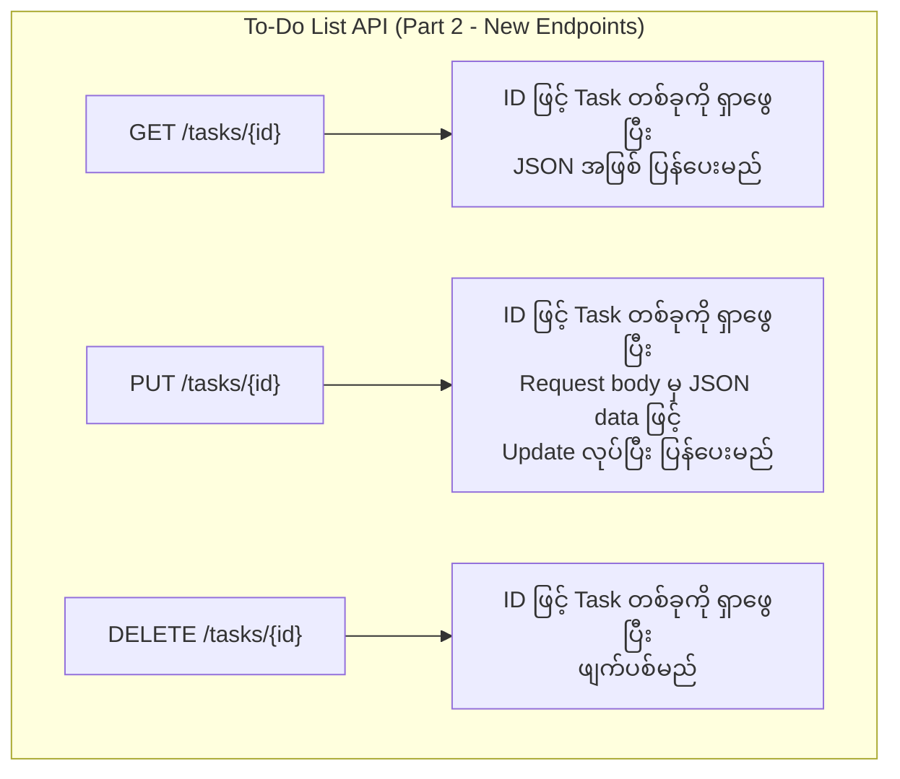

# အခန်း ၁၈: Project - Simple REST API တည်ဆောက်ခြင်း (အပိုင်း ၂)

ယခင်အခန်းတွင် ကျွန်ုပ်တို့၏ To-Do List API အတွက် အခြေခံ server တစ်ခုကို `net/http` package ဖြင့် တည်ဆောက်ခဲ့ပြီး `GET /tasks` နှင့် `POST /tasks` endpoints များကို implement လုပ်ခဲ့ပါသည်။

ယခုအခန်းတွင် API ကို ပိုမိုစွမ်းဆောင်ရည်ပြည့်ဝအောင် တိုးချဲ့တည်ဆောက်သွားပါမည်။

1.  Task တစ်ခုချင်းစီကို ID ဖြင့် `GET`, `PUT`, `DELETE` လုပ်နိုင်သော endpoints များ ထပ်မံထည့်သွင်းပါမည်။
2.  Go 1.22+ တွင် စတင်မိတ်ဆက်ခဲ့သော **Enhanced `net/http` ServeMux** ကို အသုံးပြု၍ routing ကို ပြန်လည်တည်ဆောက်ပါမည်။

---

## Go 1.22+ Standard Library Router

Go 1.22 မတိုင်မီက၊ URL path parameters (e.g., `/tasks/{id}`) များကို ကိုင်တွယ်ရန် `gorilla/mux` သို့မဟုတ် `chi` ကဲ့သို့သော third-party library များကို အသုံးပြုလေ့ရှိခဲ့သည်။

သို့သော် Go 1.22 တွင် standard `net/http` router သည် သိသိသာသာ အဆင့်မြှင့်တင်မှုများ ပါဝင်လာပြီး၊ external dependencies မလိုဘဲ အောက်ပါတို့ကို လုပ်ဆောင်နိုင်ပြီဖြစ်သည်။

*   **Method Matching:** HTTP method (`GET`, `POST` etc.) ကို pattern တွင် တိုက်ရိုက်သတ်မှတ်နိုင်ခြင်း (e.g., `"GET /tasks"`).
*   **Path Variables:** URL path အတွင်းရှိ dynamic တန်ဖိုးများကို `{name}` ပုံစံဖြင့် ဖမ်းယူနိုင်ခြင်း (e.g., `/tasks/{id}`).

---

## API Endpoints အသစ်များ ထပ်တိုးခြင်း

ကျွန်ုပ်တို့၏ API ကို အောက်ပါ endpoints များဖြင့် တိုးချဲ့ပါမည်။



---

## Code ကို Refactor လုပ်ခြင်း နှင့် Handlers အသစ်များ ရေးသားခြင်း

အောက်ပါ code သည် Go 1.22 ၏ router feature အသစ်များကို အသုံးပြု၍ ရေးသားထားသော `main.go` ၏ ပြီးပြည့်စုံသော version ဖြစ်သည်။

**`main.go` (Updated Version)**

```go
package main

import (
	"encoding/json"
	"fmt"
	"log"
	"net/http"
	"strconv"
	"sync"
)

type Task struct {
	ID        int    `json:"id"`
	Title     string `json:"title"`
	Completed bool   `json:"completed"`
}

var (
	tasks  = make(map[int]Task)
	nextID = 1
	mu     sync.Mutex
)

// GET /tasks
func getTasks(w http.ResponseWriter, r *http.Request) {
	mu.Lock()
	defer mu.Unlock()
	var taskList []Task
	for _, task := range tasks {
		taskList = append(taskList, task)
	}
	w.Header().Set("Content-Type", "application/json")
	json.NewEncoder(w).Encode(taskList)
}

// POST /tasks
func createTask(w http.ResponseWriter, r *http.Request) {
	var newTask Task
	if err := json.NewDecoder(r.Body).Decode(&newTask); err != nil {
		http.Error(w, err.Error(), http.StatusBadRequest)
		return
	}
	mu.Lock()
	defer mu.Unlock()
	newTask.ID = nextID
	tasks[newTask.ID] = newTask
	nextID++
	w.Header().Set("Content-Type", "application/json")
	w.WriteHeader(http.StatusCreated)
	json.NewEncoder(w).Encode(newTask)
}

// --- Handler အသစ်များ ---

// GET /tasks/{id}
func getTask(w http.ResponseWriter, r *http.Request) {
	// Go 1.22: r.PathValue("id") ကို အသုံးပြု၍ path variable ကို ရယူသည်
	idStr := r.PathValue("id")
	id, err := strconv.Atoi(idStr)
	if err != nil {
		http.Error(w, "Invalid task ID", http.StatusBadRequest)
		return
	}

	mu.Lock()
	defer mu.Unlock()

	task, ok := tasks[id]
	if !ok {
		http.Error(w, "Task not found", http.StatusNotFound)
		return
	}

	w.Header().Set("Content-Type", "application/json")
	json.NewEncoder(w).Encode(task)
}

// PUT /tasks/{id}
func updateTask(w http.ResponseWriter, r *http.Request) {
	idStr := r.PathValue("id")
	id, err := strconv.Atoi(idStr)
	if err != nil {
		http.Error(w, "Invalid task ID", http.StatusBadRequest)
		return
	}

	var updatedTask Task
	if err := json.NewDecoder(r.Body).Decode(&updatedTask); err != nil {
		http.Error(w, err.Error(), http.StatusBadRequest)
		return
	}

	mu.Lock()
	defer mu.Unlock()

	if _, ok := tasks[id]; !ok {
		http.Error(w, "Task not found", http.StatusNotFound)
		return
	}

	updatedTask.ID = id
	tasks[id] = updatedTask

	w.Header().Set("Content-Type", "application/json")
	json.NewEncoder(w).Encode(updatedTask)
}

// DELETE /tasks/{id}
func deleteTask(w http.ResponseWriter, r *http.Request) {
	idStr := r.PathValue("id")
	id, err := strconv.Atoi(idStr)
	if err != nil {
		http.Error(w, "Invalid task ID", http.StatusBadRequest)
		return
	}

	mu.Lock()
	defer mu.Unlock()

	if _, ok := tasks[id]; !ok {
		http.Error(w, "Task not found", http.StatusNotFound)
		return
	}

	delete(tasks, id)
	w.WriteHeader(http.StatusNoContent) // 204 No Content
}

func main() {
	// Go 1.22: NewServeMux ကို အသုံးပြုခြင်း
	mux := http.NewServeMux()

	// Pattern တွင် Method နှင့် Path Variable `{id}` ကို ထည့်သွင်းသတ်မှတ်ခြင်း
	mux.HandleFunc("GET /tasks", getTasks)
	mux.HandleFunc("POST /tasks", createTask)
	mux.HandleFunc("GET /tasks/{id}", getTask)
	mux.HandleFunc("PUT /tasks/{id}", updateTask)
	mux.HandleFunc("DELETE /tasks/{id}", deleteTask)

	fmt.Println("Starting REST API server on http://localhost:8080")
	// http.ListenAndServe တွင် mux ကို pass လုပ်သည်
	if err := http.ListenAndServe(":8080", mux); err != nil {
		log.Fatalf("Could not start server: %s\n", err.Error())
	}
}
```

**Code ရှင်းလင်းချက် (Go 1.22 Features):**

1.  **`http.NewServeMux()`:** Standard library ၏ multiplexer အသစ်ကို အသုံးပြုသည်။
2.  **Strict Routing Patterns:** `mux.HandleFunc` တွင် `"GET /tasks"` သို့မဟုတ် `"DELETE /tasks/{id}"` ကဲ့သို့ Method နှင့် Path ကို တိုက်ရိုက်တွဲလျက် သတ်မှတ်နိုင်သည်။ HTTP Method မှားယွင်းပါက `405 Method Not Allowed` ကို အလိုအလျောက် ပြန်ပေးသည်။
3.  **`r.PathValue("id")`:** Request object မှ `PathValue` methood ကို ခေါ်ယူ၍ URL path variable (`{id}`) ၏ တန်ဖိုးကို အလွယ်တကူ ရယူနိုင်သည်။

ယခုအခါ Third-party library များကို အားကိုးစရာမလိုဘဲ Standard Library သက်သက်ဖြင့် Modern REST API တစ်ခုကို တည်ဆောက်နိုင်ပြီဖြစ်သည်။