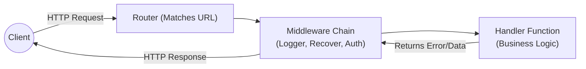

# အခန်း ၂၂: Web Development with Echo Framework

Go ၏ standard library ဖြစ်သော `net/http` သည် အလွန်ကောင်းမွန်သော်လည်း၊ ကြီးမားသော web application များ တည်ဆောက်ရာတွင် ပိုမိုလွယ်ကူမြန်ဆန်စေရန် Web Framework များကို အသုံးပြုလေ့ရှိသည်။ **Echo** သည် Go အတွက် လူကြိုက်အများဆုံး၊ စွမ်းဆောင်ရည်မြင့်မားပြီး (High Performance)၊ ရိုးရှင်းသော (Minimalist) web framework တစ်ခုဖြစ်သည်။


## Echo ကို Install ပြုလုပ်ခြင်း

ပထမဦးစွာ Echo package ကို download လုပ်ရန်လိုအပ်သည်။

```sh
go get github.com/labstack/echo/v4
```


## Data Binding

Echo သည် request payload (JSON, XML, Form) မှ data များကို Go struct သို့ပြောင်းလဲရန် `Bind` method ကို ထောက်ပံ့ပေးထားသည်။ ၎င်းသည် Content-Type header ကို ကြည့်ရှုပြီး အလိုအလျောက် mapping လုပ်ပေးသည်။

```go
type User struct {
    Name  string `json:"name" form:"name" query:"name"`
    Email string `json:"email" form:"email" query:"email"`
}

e.POST("/users", func(c echo.Context) error {
    u := new(User)
    if err := c.Bind(u); err != nil {
        return err
    }
    return c.JSON(http.StatusOK, u)
})
```


## Basic Echo Server

အောက်ပါ code သည် အရိုးရှင်းဆုံး Echo web server တစ်ခုဖြစ်သည်။

```go
package main

import (
    "net/http"
    "github.com/labstack/echo/v4"
)

func main() {
    // Echo instance တစ်ခု တည်ဆောက်ခြင်း
    e := echo.New()

    // Route တစ်ခု သတ်မှတ်ခြင်း
    e.GET("/", func(c echo.Context) error {
        return c.String(http.StatusOK, "Hello, World!")
    })

    // Server ကို Port 8080 တွင် run ခြင်း
    e.Logger.Fatal(e.Start(":8080"))
}
```

*   `echo.New()`: Echo instance အသစ်တစ်ခုကို ဖန်တီးသည်။
*   `e.GET("/", ...)`: HTTP GET request အတွက် route တစ်ခု သတ်မှတ်သည်။
*   `c.String(...)`: String response ပြန်ပေးသည်။


## Echo Request Lifecycle

Echo တွင် request တစ်ခု ဝင်ရောက်လာပုံနှင့် response ပြန်ထွက်သွားပုံကို နားလည်ရန် အရေးကြီးသည်။




## Routing

Echo သည် routing ပိုင်းတွင် အလွန်စွမ်းဆောင်ရည်ကောင်းမွန်ပြီး ရေးသားရလွယ်ကူသည်။

### Path Parameters

URL path ထဲရှိ value များကို ရယူရန် `:` ကို အသုံးပြုသည်။

```go
// e.g., GET /users/123
e.GET("/users/:id", func(c echo.Context) error {
    id := c.Param("id")
    return c.String(http.StatusOK, "User ID: " + id)
})
```

### Query Parameters

URL query string (e.g., `?name=John`) ကို ရယူရန် `QueryParam` ကို အသုံးပြုသည်။

```go
// e.g., GET /show?team=Arsenal&member=Saka
e.GET("/show", func(c echo.Context) error {
    team := c.QueryParam("team")
    member := c.QueryParam("member")
    return c.String(http.StatusOK, "Team: " + team + ", Member: " + member)
})
```


## Context & Responses

`echo.Context` သည် request နှင့် response ကို ကိုင်တွယ်ရန် အဓိက interface ဖြစ်သည်။

*   **JSON Response:**
    ```go
    type User struct {
        Name  string `json:"name"`
        Email string `json:"email"`
    }

    e.GET("/json", func(c echo.Context) error {
        u := &User{
            Name:  "Jon",
            Email: "jon@labstack.com",
        }
        return c.JSON(http.StatusOK, u)
    })
    ```

*   **HTML Response:**
    ```go
    e.GET("/html", func(c echo.Context) error {
        return c.HTML(http.StatusOK, "<strong>Hello!</strong>")
    })
    ```


## Middleware

Middleware ဆိုသည်မှာ request တစ်ခုကို handler function ဆီမရောက်ခင် သို့မဟုတ် response ပြန်မပေးခင် ကြားခံလုပ်ဆောင်ပေးသော function များဖြစ်သည်။ Echo တွင် built-in middleware များစွာပါဝင်သည်။

```go
import "github.com/labstack/echo/v4/middleware"

// ...

// Root level middleware
e.Use(middleware.Logger())  // Request တိုင်းကို log မှတ်ပေးသည်
e.Use(middleware.Recover()) // Panic ဖြစ်သွားလျှင် server မကျသွားအောင် ကာကွယ်ပေးသည်
```

### Custom Middleware ရေးသားခြင်း

မိမိကိုယ်ပိုင် middleware များကိုလည်း လွယ်ကူစွာ ရေးသားနိုင်သည်။

```go
func ServerHeader(next echo.HandlerFunc) echo.HandlerFunc {
    return func(c echo.Context) error {
        c.Response().Header().Set("X-Server", "Echo/4.0")
        return next(c)
    }
}

func main() {
    e := echo.New()
    e.Use(ServerHeader)
    // ...
}
```


## Example: Simple REST API

အောက်ပါဥပမာသည် User များကို create လုပ်ခြင်းနှင့် get လုပ်ခြင်းအတွက် ရိုးရှင်းသော REST API တစ်ခုဖြစ်သည်။

```go
package main

import (
    "net/http"
    "github.com/labstack/echo/v4"
    "github.com/labstack/echo/v4/middleware"
)

type User struct {
    ID   string `json:"id"`
    Name string `json:"name"`
}

var users = []User{
    {ID: "1", Name: "Mg Mg"},
    {ID: "2", Name: "Aung Aung"},
}

func main() {
    e := echo.New()

    // Middleware
    e.Use(middleware.Logger())
    e.Use(middleware.Recover())

    // Routes
    e.GET("/users", getUsers)
    e.GET("/users/:id", getUser)
    e.POST("/users", createUser)

    e.Logger.Fatal(e.Start(":8080"))
}

// Handler Functions

func getUsers(c echo.Context) error {
    return c.JSON(http.StatusOK, users)
}

func getUser(c echo.Context) error {
    id := c.Param("id")
    for _, u := range users {
        if u.ID == id {
            return c.JSON(http.StatusOK, u)
        }
    }
    return c.JSON(http.StatusNotFound, map[string]string{"message": "User not found"})
}

func createUser(c echo.Context) error {
    u := new(User)
    if err := c.Bind(u); err != nil {
        return err
    }
    users = append(users, *u)
    return c.JSON(http.StatusCreated, u)
}
```

ဤအခန်းတွင် Echo framework ၏ အခြေခံများကို မိတ်ဆက်ပေးခဲ့သည်။ Echo သည် အလွန်ကျယ်ပြန့်သော framework တစ်ခုဖြစ်ပြီး validation, JWT authentication, websocket စသည်တို့ကိုလည်း support ပေးပါသည်။ ပိုမိုလေ့လာရန် [Echo Documentation](https://echo.labstack.com/) တွင် ဖတ်ရှုနိုင်ပါသည်။
